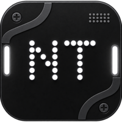

  
  

 

> **An Xposed module designed to customize and enhance the Nothing OS experience.**

By leveraging the modern Xposed framework, this module injects deep system-level tweaks allowing you to tailor your Nothing device exactly to your liking.

## 🌐 [Source Code & Support](https://github.com/RevealedSoulEven/NothingTweaks)

## ✨ Features

Nothing Tweaks comes packed with a variety of modifications to elevate your Nothing OS experience:

<b>🔒 Lockscreen</b>

 

| Feature | Description |
| :--- | :--- |
| **Scramble PIN** | Randomizes the positions of the PIN keypad digits on every unlock attempt. |
| **Hide Clock** | Hides the stock lockscreen clock and widgets (smartspace), ideal for third-party depth effect wallpapers. |
| **Remove Glimpse Ads** | Disables the sponsored Glance / Glimpse magazine wallpaper on the lock screen. |
| **Skip Power-Off Verification** | Allows powering off or restarting the device from the lock screen without entering your PIN/password. |
| **Additional Charging Info** | Displays real-time wattage (W), current (mA), voltage (V), and battery temperature (°C) while charging. Positioned 10dp above the fingerprint/lock icon. |
| **Double Tap to Sleep** | Double tap any empty area on the lockscreen to immediately turn off the screen. |
| **Double Tap to Wake** | Double tap the screen while screen is off or in AOD to wake the device. |

<b>🔊 Volume</b>

 

| Feature | Description |
| :--- | :--- |
| **Volume Panel Timeout** | Customize the duration (in milliseconds) before the volume slider automatically dismisses (default: 3000 ms). |

<b>📸 Screenshots &amp; Screen Recording</b>

 

| Feature | Description |
| :--- | :--- |
| **Screenshot Serial Number** | Optionally watermarks your device serial number (`SN: <serial>`) onto captured screenshots. |
| **Screen Recording Quality Clamp** | Force the built-in screen recorder to clamp at 720p or 1080p @ 60fps for smoother or lower-bandwidth recordings. |

<b>⏰ Status Bar Clock</b>

 

| Feature | Description |
| :--- | :--- |
| **Show Seconds** | Displays real-time seconds in the status bar clock. |
| **Show Day of Week** | Prepends the abbreviated weekday (e.g. `Mon 10:10`) to the status bar clock. |
| **Custom Text** | Appends custom text after the status bar time (up to 24 characters). |

<b>👆 In-Display Fingerprint</b>

 

| Feature | Description |
| :--- | :--- |
| **Color Scanning Dots** | Re-colors the animated scanning ripple dots around your finger during biometric authentication. |
| **Random Color Every Tap** | Automatically rolls a fresh, vibrant color every time you touch the fingerprint scanner. |
| **Custom Color Picker** | Choose any custom static color via a built-in color picker (when random mode is off). |

<b>📱 Status Bar</b>

 

| Feature | Description |
| :--- | :--- |
| **Status Bar Edge Padding** | Adjust left and right edge spacing of the status bar content to match your display corners. |
| **Nothing Earphone Icon** | Replaces the generic Bluetooth status bar icon with the official Nothing earbud glyph whenever any Bluetooth audio device is connected. |
| **Notification Icon Limit** | Set the maximum number of notification icons shown in the status bar and AOD. |
| **Status Bar Brightness Slider** | Slide your finger horizontally across the status bar to smoothly adjust screen brightness. |

<b>⚙️ Device Features</b>

 

| Feature | Description |
| :--- | :--- |
| **Stepless Volume** | Unlocks continuous, granular volume adjustment levels. |
| **Super Volume Boost** | Enables a higher maximum audio volume ceiling. |
| **Palm Touch Sleep** | Turn off the screen by covering the display with your palm on the lockscreen. |
| **Flip to Record** | Flip the phone face-down to automatically start voice recording. |

<b>🧭 Navigation &amp; Gestures</b>

 

| Feature | Description |
| :--- | :--- |
| **Hide Nav Bar (with Circle to Search)** | Hides the navigation bar gesture pill completely while preserving all gesture navigation and Circle to Search functionality. |
| **Hide Keyboard Space** | Removes the blank space beneath the keyboard and hides the navigation bar handle while typing. |
| **Long Swipe Back to Kill App** | Hold the back swipe gesture and release to immediately kill and force-stop the foreground application. |

<b>🤖 AI &amp; Miscellaneous</b>

 

| Feature | Description |
| :--- | :--- |
| **Gemini AI Clipboard Chip** | Redirects the Nothing OS clipboard AI action chip to Google Gemini instead of ChatGPT. |
| **Disable Temperature Warnings** | Disables intrusive high-temperature system warning dialogs. |

<b>🛠️ System</b>

 

| Feature | Description |
| :--- | :--- |
| **Allow 180° Rotation** | Allows the screen to rotate completely upside-down (reverse portrait). |
| **Advanced Power Menu** | Adds direct reboot options for Recovery and Bootloader / Fastboot to the power menu. |

## 🚀 Installation

1. Ensure your device is rooted and **[LSPosed](https://github.com/LSPosed/LSPosed)** is installed.
2. Download the latest Nothing Tweaks APK from the **[Releases](https://github.com/RevealedSoulEven/NothingTweaks/releases/)** page and install it.
3. Open the **LSPosed Manager** app and enable the Nothing Tweaks module.
4. Reboot your device (or restart `SystemUI` and `Nothing Launcher`) to apply the changes.
5. Open the **Nothing Tweaks** app to configure your settings!

## 🤝 Credits & Acknowledgements

This project would not have been possible without the amazing work of the Android modding community. Special thanks to:

* **[rovo89](https://github.com/rovo89)** - For creating the original [Xposed Framework](https://github.com/rovo89/Xposed), which pioneered this level of Android customization.
* **[LSPosed Team](https://github.com/LSPosed/LSPosed)** - For maintaining and advancing the modern ART hooking framework that powers this module today.
* **[Rares6567](https://github.com/Rares6567)** - For _"hide space under keyboard"_ feature. And his project [NothingXpert](https://github.com/Rares6567/NothingXpert).

 

---
*Disclaimer: This module modifies system-level components. Use it at your own risk.*
